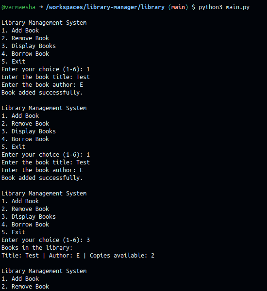
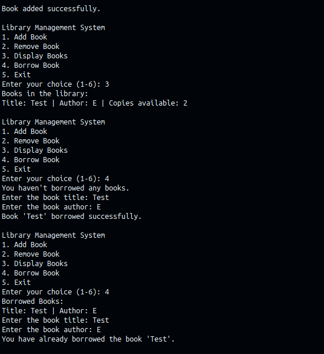

# library-manager

## Folder structure

```
library/
├── main.py
├── books/
│   ├── book.py
└── library/
    └── library.py
```

## Assumptions/Considerations

1. The user can add and remove books from the library.
2. These steps determine content of library.
3. As per the user stories, since 2nd was subset of 3rd have covered 3 user stories.
4. While adding a book, have considered author name to be added as well.

## Screenshots

### Adding the user stories screenshot below:

1. User can view books in library



2. User can borrow a book from the library &
3. User can borrow a copy of a book from the library


