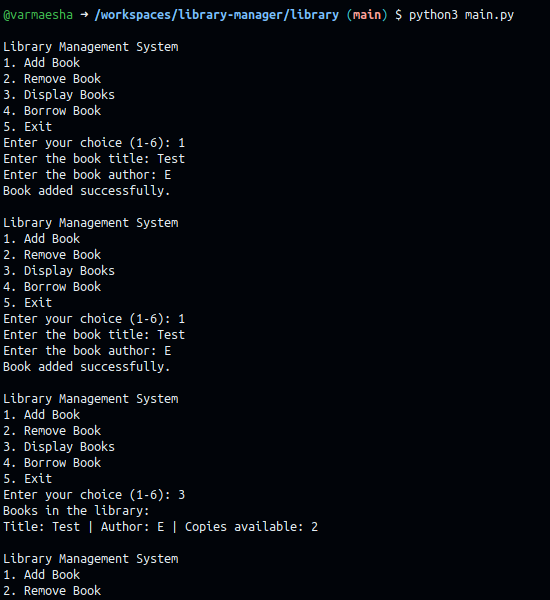
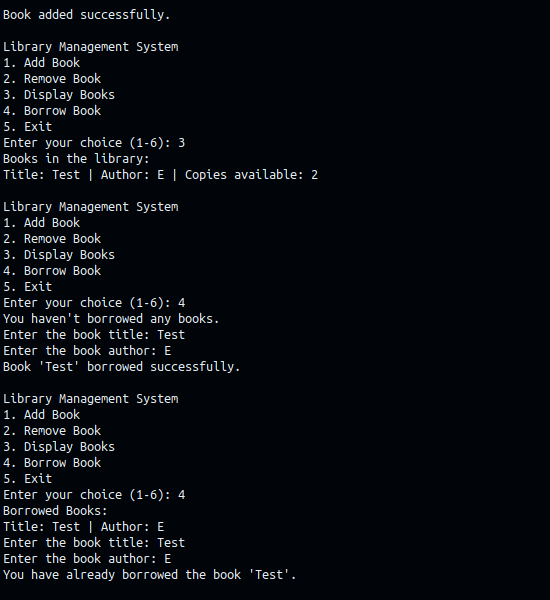

# library-manager

## Folder structure

```
library/
├── main.py
├── books/
│   ├── book.py
└── library/
    └── library.py
```

## Assumptions/Considerations

1. The user can add and remove books from the library.
2. These steps determine the content of the library.
3. As per the user stories, since the 2nd was a subset of the 3rd, I have covered 3 user stories.
4. While adding a book, I have considered the author's name to be added as well.

## Screenshots

### Adding the user stories screenshot below:

1. User can view books in the library



2. User can borrow a book from the library & 3. User can borrow a copy of a book from the library



## Description

This repository contains a Library Management System implemented in Python. It includes the following classes:

### Book Class

The `Book` class represents a book with attributes `title` and `author`. It also defines the `__eq__` and `__hash__` methods for comparison and hashing.

### Library Class

The `Library` class manages the books in the library. It has methods to add, remove, display, borrow, and return books. Books are stored in a list and the number of available copies is tracked using a dictionary.

## How to Use

1. Run the `main.py` file to start the Library Management System.
2. Choose options from 1 to 6 to perform different actions in the library.
3. Follow the on-screen instructions to add, remove, display, borrow, and return books.
4. When done, select option 6 to exit the program.

Feel free to contribute and enhance the Library Management System! Happy reading! 📚